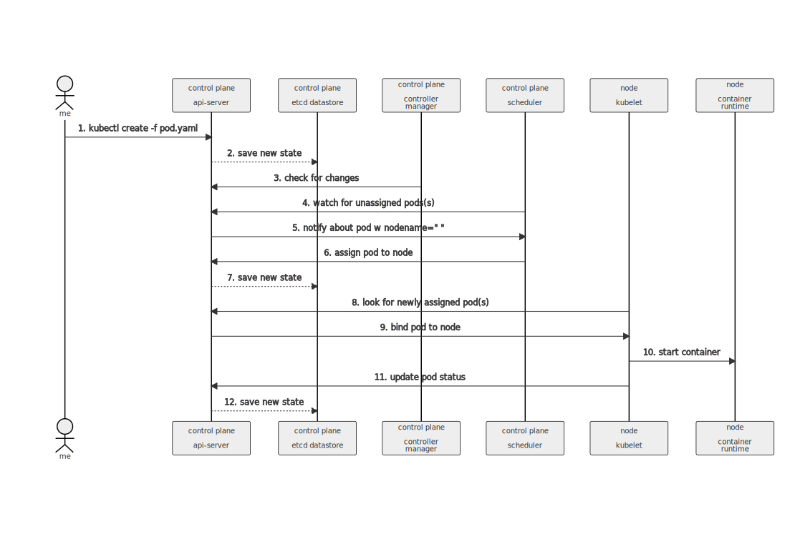

# How to use Mermaid to add figures to your K8s docs contributions 

Mermaid is a package for generating figures using simple text in markdown files. This document explains how you can use Mermaid to create and add figures to your K8s docs contributions. It includes multiple examples, live-editor references and three methods for generating and embedding Mermaid figures inside your documentation.

The target audience for this document is anybody wishing to learn about Mermaid and/or how to create and add figures to Kubernetes documentation. 

---

<br>


## What you need to know before working with Mermaid

- Basic understanding of markdown
- Using the Mermaid live editor
- [How to use Hugo shortcodes](https://kubernetes.io/docs/contribute/style/hugo-shortcodes/) 
- Procedures to perform [local preview build](https://kubernetes.io/docs/contribute/new-content/open-a-pr/#preview-locally)

---

<br>

## References

- [Mermaid docs](https://mermaid-js.github.io/mermaid/#/)

- [Mermaid live editor](https://mermaid-js.github.io/mermaid-live-editor)

---

<br>

## Why should I use Mermaid?

- Diagrams improve documentation clarity and comprehension.

- Simple, inline code syntax you add to the markdown file.

- Included in K8s docs and docsy theme.

- On-line live editor to create and edit figures. 
  
- Live editor generates a link beginning for each figure. You can share this link with colleagues to collaborate on figure creation and editing.

Live editor links begin with `https://mermaid-js.github.io/mermaid-live-editor/edit`.

- Figure updates are simple: just open a PR and edit the mermaid code in the respective markdown file.

Basically, Mermaid provides a simple, open and transparent method for the community to add, edit and collaborate on figures for new or existing documents.


--- 

<br>

## K8s docs Mermaid examples

This section contains examples of Mermaid figures currently used in K8s docs. Each example includes the docs page where the figure is rendered, a link to the repo source markdown file, live editor link, the actual figure and the mermaid code encapsulated in the hugo `` shortcode. 

Docs page: [Contribute to K8s docs](https://kubernetes.io/docs/contribute/)

K8s/website repo file link: [../contribute/_index.md](https://github.com/kubernetes/website/blob/main/content/en/docs/contribute/_index.md)

Live editor link: [figure](https://mermaid-js.github.io/mermaid-live-editor/edit/#eyJjb2RlIjoiZmxvd2NoYXJ0IFRCXG4gICAgc3ViZ3JhcGggdGhpcmRbT3BlbiBQUl1cbiAgICAgICAgZGlyZWN0aW9uIFRCXG4gICAgICAgIFVbIF0gLS4tXG4gICAgICAgIFFbSW1wcm92ZSBjb250ZW50XSAtLS0gTltDcmVhdGUgY29udGVudF1cbiAgICAgICAgTiAtLS0gT1tUcmFuc2xhdGUgZG9jc11cbiAgICAgICAgTyAtLS0gUFtNYW5hZ2UvcHVibGlzaCBkb2NzIHBhcnRzPGJyPm9mIEs4cyByZWxlYXNlIGN5Y2xlXVxuIFxuICAgIGVuZFxuXG4gICAgc3ViZ3JhcGggc2Vjb25kW1Jldmlld11cbiAgICBkaXJlY3Rpb24gVEJcbiAgICAgICBUWyBdIC0uLVxuICAgICAgIERbTG9vayBvdmVyIHRoZTxicj5LOHMvd2Vic2l0ZTxicj5yZXBvc2l0b3J5XSAtLS0gRVtDaGVjayBvdXQgdGhlPGJyPkh1Z28gc3RhdGljIHNpdGU8YnI-Z2VuZXJhdG9yXVxuICAgICAgIEUgLS0tIEZbVW5kZXJzdGFuZCBiYXNpYzxicj5HaXRIdWIgY29tbWFuZHNdXG4gICAgICAgRiAtLS0gR1tSZXZpZXcgb3BlbiBQUjxicj5hbmQgY2hhbmdlIHJldmlldyA8YnI-cHJvY2Vzc2VzXVxuICAgIGVuZFxuXG4gICAgc3ViZ3JhcGggZmlyc3RbU2lnbiB1cF1cbiAgICAgICAgZGlyZWN0aW9uIFRCXG4gICAgICAgIFNbIF0gLS4tXG4gICAgICAgIEJbU2lnbiB0aGUgQ05DRjxicj5Db250cmlidXRvcjxicj5MaWNlbnNlIEFncmVlbWVudF0gLS0tIENbSm9pbiBzaWctZG9jczxicj5TbGFjayBjaGFubmVsXSBcbiAgICAgICAgQyAtLS0gVltKb2luIGt1YmVybmV0ZXMtc2lnLWRvY3M8YnI-bWFpbGluZyBsaXN0XVxuICAgICAgICBWIC0tLSBNW0F0dGVuZCB3ZWVrbHk8YnI-c2lnLWRvY3MgY2FsbHM8YnI-b3Igc2xhY2sgbWVldGluZ3NdXG4gICAgZW5kXG4gICAgXG4gICAgQShbZmE6ZmEtdXNlciBOZXc8YnI-Q29udHJpYnV0b3JdKSAtLT4gZmlyc3RcbiAgICBBIC0tPiBzZWNvbmRcbiAgICBBIC0tPiB0aGlyZFxuICAgIEEgLS0-IEhbQXNrIFF1ZXN0aW9ucyEhIV1cbiAgICAgXG5cbmNsYXNzRGVmIGdyZXkgZmlsbDojZGRkZGRkLHN0cm9rZTojZmZmZmZmLHN0cm9rZS13aWR0aDpweCxjb2xvcjojMDAwMDAwLCBmb250LXNpemU6MTVweDtcbmNsYXNzRGVmIHdoaXRlIGZpbGw6I2ZmZmZmZixzdHJva2U6IzAwMCxzdHJva2Utd2lkdGg6cHgsY29sb3I6IzAwMCxmb250LXdlaWdodDpib2xkXG5jbGFzc0RlZiBzcGFjZXdoaXRlIGZpbGw6I2ZmZmZmZixzdHJva2U6I2ZmZixzdHJva2Utd2lkdGg6MHB4LGNvbG9yOiMwMDBcbmNsYXNzIEEsQixDLEQsRSxGLEcsSCxNLFEsTixPLFAsViBncmV5XG5jbGFzcyBTLFQsVSBzcGFjZXdoaXRlXG5jbGFzcyBmaXJzdCxzZWNvbmQsdGhpcmQgd2hpdGVcblxuXG5cblxuXG4iLCJtZXJtYWlkIjoie1xuICBcInRoZW1lXCI6IFwiZGVmYXVsdFwiXG59IiwidXBkYXRlRWRpdG9yIjpmYWxzZSwiYXV0b1N5bmMiOnRydWUsInVwZGF0ZURpYWdyYW0iOnRydWV9)

Figure:


Code:
```mermaid

flowchart TB
    subgraph third[Open PR]
        direction TB
        U[ ] -.-
        Q[Improve content] --- N[Create content]
        N --- O[Translate docs]
        O --- P[Manage/publish docs parts<br>of K8s release cycle]
 
    end

    subgraph second[Review]
    direction TB
       T[ ] -.-
       D[Look over the<br>K8s/website<br>repository] --- E[Check out the<br>Hugo static site<br>generator]
       E --- F[Understand basic<br>GitHub commands]
       F --- G[Review open PR<br>and change review <br>processes]
    end

    subgraph first[Sign up]
        direction TB
        S[ ] -.-
        B[Sign the CNCF<br>Contributor<br>License Agreement] --- C[Join sig-docs<br>Slack channel] 
        C --- V[Join kubernetes-sig-docs<br>mailing list]
        V --- M[Attend weekly<br>sig-docs calls<br>or slack meetings]
    end
    
    A([fa:fa-user New<br>Contributor]) --> first
    A --> second
    A --> third
    A --> H[Ask Questions!!!]
     

classDef grey fill:#dddddd,stroke:#ffffff,stroke-width:px,color:#000000, font-size:15px;
classDef white fill:#ffffff,stroke:#000,stroke-width:px,color:#000,font-weight:bold
classDef spacewhite fill:#ffffff,stroke:#fff,stroke-width:0px,color:#000
class A,B,C,D,E,F,G,H,M,Q,N,O,P,V grey
class S,T,U spacewhite
class first,second,third white

```

---

<br>

Docs page: [What is Ingress](https://kubernetes.io/docs/concepts/services-networking/ingress/#what-is-ingress)

K8s/website repo file link: [ingress.md](https://github.com/kubernetes/website/blob/main/content/en/docs/concepts/services-networking/ingress.md)

Live editor link: [figure](https://mermaid-js.github.io/mermaid-live-editor/edit/#eyJjb2RlIjoiZ3JhcGggIExSXG4gIGNsaWVudChbY2xpZW50XSktLiBJbmdyZXNzLW1hbmFnZWQgPGJyPiBsb2FkIGJhbGFuY2VyIC4tPmluZ3Jlc3NbSW5ncmVzc107XG4gIGluZ3Jlc3MtLT58cm91dGluZyBydWxlfHNlcnZpY2VbU2VydmljZV07XG4gIHN1YmdyYXBoIGNsdXN0ZXJcbiAgaW5ncmVzcztcbiAgc2VydmljZS0tPnBvZDFbUG9kXTtcbiAgc2VydmljZS0tPnBvZDJbUG9kXTtcbiAgZW5kXG4gIGNsYXNzRGVmIHBsYWluIGZpbGw6I2RkZCxzdHJva2U6I2ZmZixzdHJva2Utd2lkdGg6NHB4LGNvbG9yOiMwMDA7XG4gIGNsYXNzRGVmIGs4cyBmaWxsOiMzMjZjZTUsc3Ryb2tlOiNmZmYsc3Ryb2tlLXdpZHRoOjRweCxjb2xvcjojZmZmO1xuICBjbGFzc0RlZiBjbHVzdGVyIGZpbGw6I2ZmZixzdHJva2U6I2JiYixzdHJva2Utd2lkdGg6MnB4LGNvbG9yOiMzMjZjZTU7XG4gIGNsYXNzIGluZ3Jlc3Msc2VydmljZSxwb2QxLHBvZDIgazhzO1xuICBjbGFzcyBjbGllbnQgcGxhaW47XG4gIGNsYXNzIGNsdXN0ZXIgY2x1c3RlcjtcbiIsIm1lcm1haWQiOiJ7XG4gIFwidGhlbWVcIjogXCJkZWZhdWx0XCJcbn0iLCJ1cGRhdGVFZGl0b3IiOmZhbHNlLCJhdXRvU3luYyI6dHJ1ZSwidXBkYXRlRGlhZ3JhbSI6ZmFsc2V9) 

Figure:



Code:
```mermaid

graph LR;
 client([client])-. Ingress-managed <br> load balancer .->ingress[Ingress];
 ingress-->|routing rule|service[Service];
 subgraph cluster
 ingress;
 service-->pod1[Pod];
 service-->pod2[Pod];
 end
 classDef plain fill:#ddd,stroke:#fff,stroke-width:4px,color:#000;
 classDef k8s fill:#326ce5,stroke:#fff,stroke-width:4px,color:#fff;
 classDef cluster fill:#fff,stroke:#bbb,stroke-width:2px,color:#326ce5;
 class ingress,service,pod1,pod2 k8s;
 class client plain;
 class cluster cluster;

```

---

<br>

Docs page: [Pod Topology Spread Constraints#node labels](https://kubernetes.io/docs/concepts/workloads/pods/pod-topology-spread-constraints/#node-labels)

K8s/website repo file link: [ ../docs/concepts/workloads/pods/pod-topology-spread-constraints.md](https://github.com/kubernetes/website/blob/main/content/en/docs/concepts/workloads/pods/pod-topology-spread-constraints.md)

Live editor link: [figure](https://mermaid-js.github.io/mermaid-live-editor/edit/#eyJjb2RlIjoiZ3JhcGggVEJcbiAgICBzdWJncmFwaCBcInpvbmVCXCJcbiAgICAgICAgbjMoTm9kZTMpXG4gICAgICAgIG40KE5vZGU0KVxuICAgIGVuZFxuICAgIHN1YmdyYXBoIFwiem9uZUFcIlxuICAgICAgICBuMShOb2RlMSlcbiAgICAgICAgbjIoTm9kZTIpXG4gICAgZW5kXG5cbiAgICBjbGFzc0RlZiBwbGFpbiBmaWxsOiNkZGQsc3Ryb2tlOiNmZmYsc3Ryb2tlLXdpZHRoOjRweCxjb2xvcjojMDAwO1xuICAgIGNsYXNzRGVmIGs4cyBmaWxsOiMzMjZjZTUsc3Ryb2tlOiNmZmYsc3Ryb2tlLXdpZHRoOjRweCxjb2xvcjojZmZmO1xuICAgIGNsYXNzRGVmIGNsdXN0ZXIgZmlsbDojZmZmLHN0cm9rZTojYmJiLHN0cm9rZS13aWR0aDoycHgsY29sb3I6IzMyNmNlNTtcbiAgICBjbGFzcyBuMSxuMixuMyxuNCBrOHM7XG4gICAgY2xhc3Mgem9uZUEsem9uZUIgY2x1c3RlcjtcbiIsIm1lcm1haWQiOiJ7XG4gIFwidGhlbWVcIjogXCJkZWZhdWx0XCJcbn0iLCJ1cGRhdGVFZGl0b3IiOmZhbHNlLCJhdXRvU3luYyI6dHJ1ZSwidXBkYXRlRGlhZ3JhbSI6dHJ1ZX0)

Figure:



Code:
```mermaid

graph TB
   subgraph "zoneB"
       n3(Node3)
       n4(Node4)
   end
   subgraph "zoneA"
       n1(Node1)
       n2(Node2)
   end
 
   classDef plain fill:#ddd,stroke:#fff,stroke-width:4px,color:#000;
   classDef k8s fill:#326ce5,stroke:#fff,stroke-width:4px,color:#fff;
   classDef cluster fill:#fff,stroke:#bbb,stroke-width:2px,color:#326ce5;
   class n1,n2,n3,n4 k8s;
   class zoneA,zoneB cluster;

```
---

<br>

Docs page: [Example: OneTopologySpreadConstraint](https://kubernetes.io/docs/concepts/workloads/pods/pod-topology-spread-constraints/#example-one-topologyspreadconstraint) // first figure on this page

K8s/website repo file link: [ ../docs/concepts/workloads/pods/pod-topology-spread-constraints.md](https://github.com/kubernetes/website/blob/main/content/en/docs/concepts/workloads/pods/pod-topology-spread-constraints.md)

Live editor link: [figure](https://mermaid-js.github.io/mermaid-live-editor/edit/#eyJjb2RlIjoiZ3JhcGggIEJUXG4gICAgc3ViZ3JhcGggXCJ6b25lQlwiXG4gICAgICAgIHAzKFBvZCkgLS0-IG4zKE5vZGUzKVxuICAgICAgICBuNChOb2RlNClcbiAgICBlbmRcbiAgICBzdWJncmFwaCBcInpvbmVBXCJcbiAgICAgICAgcDEoUG9kKSAtLT4gbjEoTm9kZTEpXG4gICAgICAgIHAyKFBvZCkgLS0-IG4yKE5vZGUyKVxuICAgIGVuZFxuXG4gICAgY2xhc3NEZWYgcGxhaW4gZmlsbDojZGRkLHN0cm9rZTojZmZmLHN0cm9rZS13aWR0aDo0cHgsY29sb3I6IzAwMDtcbiAgICBjbGFzc0RlZiBrOHMgZmlsbDojMzI2Y2U1LHN0cm9rZTojZmZmLHN0cm9rZS13aWR0aDo0cHgsY29sb3I6I2ZmZjtcbiAgICBjbGFzc0RlZiBjbHVzdGVyIGZpbGw6I2ZmZixzdHJva2U6I2JiYixzdHJva2Utd2lkdGg6MnB4LGNvbG9yOiMzMjZjZTU7XG4gICAgY2xhc3MgbjEsbjIsbjMsbjQscDEscDIscDMgazhzO1xuICAgIGNsYXNzIHpvbmVBLHpvbmVCIGNsdXN0ZXI7XG4iLCJtZXJtYWlkIjoie1xuICBcInRoZW1lXCI6IFwiZGVmYXVsdFwiXG59IiwidXBkYXRlRWRpdG9yIjpmYWxzZSwiYXV0b1N5bmMiOnRydWUsInVwZGF0ZURpYWdyYW0iOnRydWV9)

Figure:


Code:
```mermaid

graph TB
subgraph "zoneB"
   p3(Pod) --> n3(Node3)
   n4(Node4)
end
subgraph "zoneA"
   p1(Pod) --> n1(Node1)
   p2(Pod) --> n2(Node2)
end
 
classDef plain fill:#ddd,stroke:#fff,stroke-width:4px,color:#000;
classDef k8s fill:#326ce5,stroke:#fff,stroke-width:4px,color:#fff;
classDef cluster fill:#fff,stroke:#bbb,stroke-width:2px,color:#326ce5;
class n1,n2,n3,n4,p1,p2,p3 k8s;
class zoneA,zoneB cluster;

```

---

<br>

## Creating sequence diagrams

Sequence diagrams describe a series of actions between components that result in a completed task. You can use Mermaid to create sequence diagrams.

Here is a sequence diagram describing pod creation and container startup.



Live editor link: [figure](https://mermaid-js.github.io/mermaid-live-editor/edit/#eyJjb2RlIjoiJSV7aW5pdDp7XCJ0aGVtZVwiOlwibmV1dHJhbFwifX0lJVxuc2VxdWVuY2VEaWFncmFtXG4gICAgYWN0b3IgbWVcbiAgICBwYXJ0aWNpcGFudCBhcGlTcnYgYXMgY29udHJvbCBwbGFuZTxicj48YnI-YXBpLXNlcnZlclxuICAgIHBhcnRpY2lwYW50IGV0Y2QgYXMgY29udHJvbCBwbGFuZTxicj48YnI-ZXRjZCBkYXRhc3RvcmVcbiAgICBwYXJ0aWNpcGFudCBjbnRybE1nciBhcyBjb250cm9sIHBsYW5lPGJyPjxicj5jb250cm9sbGVyPGJyPm1hbmFnZXJcbiAgICBwYXJ0aWNpcGFudCBzY2hlZCBhcyBjb250cm9sIHBsYW5lPGJyPjxicj5zY2hlZHVsZXJcbiAgICBwYXJ0aWNpcGFudCBrdWJlbGV0IGFzIG5vZGU8YnI-PGJyPmt1YmVsZXRcbiAgICBwYXJ0aWNpcGFudCBjb250YWluZXIgYXMgbm9kZTxicj48YnI-Y29udGFpbmVyPGJyPnJ1bnRpbWVcbiAgICBtZS0-PmFwaVNydjogMS4ga3ViZWN0bCBjcmVhdGUgLWYgcG9kLnlhbWxcbiAgICBhcGlTcnYtLT4-ZXRjZDogMi4gc2F2ZSBuZXcgc3RhdGVcbiAgICBjbnRybE1nci0-PmFwaVNydjogMy4gY2hlY2sgZm9yIGNoYW5nZXNcbiAgICBzY2hlZC0-PmFwaVNydjogNC4gd2F0Y2ggZm9yIHVuYXNzaWduZWQgcG9kcyhzKVxuICAgIGFwaVNydi0-PnNjaGVkOiA1LiBub3RpZnkgYWJvdXQgcG9kIHcgbm9kZW5hbWU9XCIgXCJcbiAgICBzY2hlZC0-PmFwaVNydjogNi4gYXNzaWduIHBvZCB0byBub2RlXG4gICAgYXBpU3J2LS0-PmV0Y2Q6IDcuIHNhdmUgbmV3IHN0YXRlXG4gICAga3ViZWxldC0-PmFwaVNydjogOC4gbG9vayBmb3IgbmV3bHkgYXNzaWduZWQgcG9kKHMpXG4gICAgYXBpU3J2LT4-a3ViZWxldDogOS4gYmluZCBwb2QgdG8gbm9kZVxuICAgIGt1YmVsZXQtPj5jb250YWluZXI6IDEwLiBzdGFydCBjb250YWluZXJcbiAgICBrdWJlbGV0LT4-YXBpU3J2OiAxMS4gdXBkYXRlIHBvZCBzdGF0dXNcbiAgICBhcGlTcnYtLT4-ZXRjZDogMTIuIHNhdmUgbmV3IHN0YXRlIiwibWVybWFpZCI6IntcbiAgXCJ0aGVtZVwiOiBcImRlZmF1bHRcIlxufSIsInVwZGF0ZUVkaXRvciI6ZmFsc2UsImF1dG9TeW5jIjp0cnVlLCJ1cGRhdGVEaWFncmFtIjp0cnVlfQ)

Code:
```

%%{init:{"theme":"neutral"}}%%
sequenceDiagram
    actor me
    participant apiSrv as control plane<br><br>api-server
    participant etcd as control plane<br><br>etcd datastore
    participant cntrlMgr as control plane<br><br>controller<br>manager
    participant sched as control plane<br><br>scheduler
    participant kubelet as node<br><br>kubelet
    participant container as node<br><br>container<br>runtime
    me->>apiSrv: 1. kubectl create -f pod.yaml
    apiSrv-->>etcd: 2. save new state
    cntrlMgr->>apiSrv: 3. check for changes
    sched->>apiSrv: 4. watch for unassigned pods(s)
    apiSrv->>sched: 5. notify about pod w nodename=" "
    sched->>apiSrv: 6. assign pod to node
    apiSrv-->>etcd: 7. save new state
    kubelet->>apiSrv: 8. look for newly assigned pod(s)
    apiSrv->>kubelet: 9. bind pod to node
    kubelet->>container: 10. start container
    kubelet->>apiSrv: 11. update pod status
    apiSrv-->>etcd: 12. save new state

```

---

<br>

## Three methods to add Mermaid figures

You have three methods for adding Mermaid figures to K8s docs: Hugo Mermaid shortcode, hybrid Mermaid+SVG and docsy theme support. 

The figure below lays out the three methods:


[Live editor link to the 3 methods figure](https://mermaid-js.github.io/mermaid-live-editor/edit#eyJjb2RlIjoiZmxvd2NoYXJ0IFRCXG4gICAgc3ViZ3JhcGggdGhpcmRbMy4gRG9jc3kgVGhlbWVdXG4gICAgZGlyZWN0aW9uIFRCXG4gICAgICAgWFsgXSAtLi0gXG4gICAgICAgRFtVc2UgbGl2ZSBlZGl0b3I8YnI-dG8gY3JlYXRlL2VkaXQgZmlndXJlXSAtLT4gUltjdXQvcGFzdGUgY29kZTxicj50byAubWQgcGFnZV1cbiAgICAgICBSIC0tPiBFW1dyYXAgbWVybWFpZCBjb2RlPGJyPmluIGBgYG1lcm1haWRgYGA8YnI-Y29kZSBibG9ja11cbiAgICAgICBFIC0tPiBGW1Rlc3QhIV1cbiAgICBlbmRcblxuICAgIHN1YmdyYXBoIHNlY29uZFsyLiBIeWJyaWQgTWVybWFpZCtTVkddXG4gICAgICAgIGRpcmVjdGlvbiBUQlxuICAgICAgICBTWyBdIC0uLVxuICAgICAgICBHW1VzZSBsaXZlIGVkaXRvcjxicj50byBjcmVhdGUvZWRpdCBmaWd1cmVdIC0tPiBKW0dlbmVyYXRlL2Rvd25sb2FkIFNWR11cbiAgICAgICAgSiAtLT4gS1tBZGQgbGl2ZSBlZGl0b3IgbGluazxicj50byBTVkcgZmlsZTxicj51c2luZyB0ZXh0IGVkaXRvcl1cbiAgICAgICAgSyAtLT4gTFtBZGQgU1ZHIGZpbGUgdG88YnI-ZG9jcyB1c2luZyBzdGFuZGFyZDxicj50ZWNobmlxdWVzXVxuICAgICAgICBMIC0tPiBPW1Rlc3QhIV0gIFxuXG4gICAgZW5kXG5cbiAgICBzdWJncmFwaCBmaXJzdFsxLiBTaG9ydGNvZGVdXG4gICAgZGlyZWN0aW9uIFRCXG4gICAgICAgIFlbIF0gLS4tXG4gICAgICAgIEJbVXNlIGxpdmUgZWRpdG9yPGJyPnRvIGNyZWF0ZS9lZGl0IGZpZ3VyZV0gLS0-IFFbY3V0L3Bhc3RlIGNvZGU8YnI-dG8gLm1kIHBhZ2VdIFxuICAgICAgICBRIC0tPiBDW1dyYXAgbWVybWFpZCBjb2RlPGJyPiBpbiBzaG9ydGNvZGUgdGFnc10gLS0-IFBbVGVzdCEhXVxuICAgIGVuZFxuICAgIFxuICAgIEEoW2ZhOmZhLXVzZXIgQ29udHJpYnV0b3JdKSAtLT4gZmlyc3RcbiAgICBBIC0tPiBzZWNvbmRcbiAgICBBIC0tPiB0aGlyZFxuICAgIFxuICAgICBcblxuY2xhc3NEZWYgYmx1ZSBmaWxsOiNkZGQsc3Ryb2tlOiNmZmZmZmYsc3Ryb2tlLXdpZHRoOnB4LGNvbG9yOiMwMDAwMDAsIGZvbnQtc2l6ZToxNXB4O1xuY2xhc3NEZWYgd2hpdGUgZmlsbDojZmZmZmZmLHN0cm9rZTojMDAwLHN0cm9rZS13aWR0aDpweCxjb2xvcjojMDAwLGZvbnQtd2VpZ2h0OmJvbGRcbmNsYXNzRGVmIHNwYWNld2hpdGUgZmlsbDojZmZmZmZmLHN0cm9rZTojZmZmLHN0cm9rZS13aWR0aDowcHgsY29sb3I6IzAwMFxuY2xhc3MgQSxCLEMsRCxFLEYsRyxILE0sSixLLEwsTyxQLFEsUiBibHVlXG5jbGFzcyBTLFgsWSBzcGFjZXdoaXRlXG5jbGFzcyBmaXJzdCxzZWNvbmQsdGhpcmQgd2hpdGVcbiIsIm1lcm1haWQiOiJ7XG4gIFwidGhlbWVcIjogXCJkZWZhdWx0XCJcbn0iLCJ1cGRhdGVFZGl0b3IiOmZhbHNlLCJhdXRvU3luYyI6dHJ1ZSwidXBkYXRlRGlhZ3JhbSI6ZmFsc2V9)

---

<br>


### Using Hugo shortcode

K8s docs supports a Hugo shortcode for handling Mermaid figures.

* Use live editor to create and edit figures.

* Implemented and used for existing K8s docs Mermaid figures. 

* Easy to use by wrapping Mermaid code inside ` … ` shortcode tags.

* In-line Mermaid code so contributors/reviewers can edit on the fly.

Note: Add the live editor URL link as a comment in your code so contributors/reviewers can view/edit/test your mermaid code and figures.

---

<br>


### Using hybrid Mermaid+SVG

K8s docs supports SVG images. This method allows you to create/edit Mermaid figures in the live editor. Then from the live editor, you generate and download an SVG image file. Finally, add the SVG image to the docs as you would with any other SVG image.

* Use live editor to create and edit figures.

* Use live editor to generate and download SVG image.

* No change to existing K8s docs SVG image configuration. 

* Leverage new Mermaid features available in the live editor. Those features might not be available in the current K8s/website version. Check PRs or repo code to find out the Mermaid version supported in the K8s docs.

* Mermaid code is de-coupled from the K8s docs. In other words, new or edited figures show up in PRs and code as SVG images, not in-line Mermaid code.

Note: Add the live editor URL link as a comment block in the SVG file using your favorite text editor. Contributors/reviewers can then view/edit the mermaid code.

To add a comment to the SVG image file, use a text editor and add something like the following:

```mermaid
<!-- To view or edit the mermaid code, use the following URL: -->
<!-- https://mermaid-js.github.io/mermaid-live-editor/edit/#eyJjb ... -->
```

---

<br>


### Using docsy theme

Note: Check PRs to see if K8s docs has enabled docsy theme Mermaid support.

* Use live editor to create and edit figures.

* Easy to use by inserting Mermaid code inside a code block using ```mermaid …```.

* No need for shortcode tags.

* Inherits current Mermaid version from docsy.dev submodule.

* In-line Mermaid code so contributors/reviewers can edit on the fly.

Note: Add the live editor URL link as a comment in your code so contributors/reviewers can view/edit/test the mermaid code.

---

<br>


### Which method should I use?

If you wish to create, edit and add figures to K8s docs right now, you can use the Hugo shortcode or Hybrid Mermaid+SVG methods. Check PRs for docsy theme support.

Regardless of which method you choose, you should:

- Use the live editor to create and edit figures.

- Add the figure's live editor link to a comment in the markdown file or in the SVG image file. 

---

<br>


## Share Mermaid figures

You can share figures using functions included with the live editor.

* Generate and send SVG image files.

* Generate and send URL links pointing to the SVG image.

* Generate and send URL links to pointing to the figure's mermaid code.

---

<br>


### How to share SVG images

You might use this method to show a colleague a quick preview of an image you are working on. Or you could use the Hybrid+SVG method to add figures to your content. 

The following figure outlines the general workflow for sharing SVG images with the live editor.




[Live editor link to figure](https://mermaid-js.github.io/mermaid-live-editor/edit/#eyJjb2RlIjoiZ3JhcGggTFJcbkFbWW91IC8gPGJyPiBmaWd1cmUgZWRpdG9yXSAtLT4gQltjcmVhdGUgLyA8YnI-IGVkaXQgZmlndXJlXVxuQiAtLT4gQ1tzYXZlIGZpZ3VyZV1cbkMgLS0-IEZbY29weSBpbWFnZTxicj50byBjbGlwYm9hcmRdXG5DIC0tPiBHW2dlbmVyYXRlIFNWRyBsaW5rXVxuQyAtLT4gRVtkb3dubG9hZCBTVkddXG5cbiAgICBjbGFzc0RlZiBib3ggZmlsbDojZmZmLHN0cm9rZTojMDAwLHN0cm9rZS13aWR0aDoxcHgsY29sb3I6IzAwMDtcbiAgICBjbGFzcyBBLEIsQyxELEUsRixHIGJveDtcbiIsIm1lcm1haWQiOiJ7XG4gIFwidGhlbWVcIjogXCJkZWZhdWx0XCJcbn0iLCJ1cGRhdGVFZGl0b3IiOmZhbHNlLCJhdXRvU3luYyI6dHJ1ZSwidXBkYXRlRGlhZ3JhbSI6ZmFsc2V9)


Use the following procedures to share SVG or PNG images.

1. Create a figure in the live editor.

2. Under history, save the figure. This generates a unique live editor link for the figure and code. You should save this link in case you need to modify the image later.

NOTE: The current state of the figure generated from the </> Code is saved.

3. Under action, you have several options.

* Copy the image to clipboard then paste it to your favorite message or email app.

* Generate a link to the SVG image. Note this is NOT the link to the live editor mermaid figure and code contained in your browser’s URL field. The SVG image pointers begin with `https://mermaid.ink/img/`.

K8s docs not support markdown links to external figures. 

* Download the SVG image file. If you use the image in your documentation, don’t forget to add the live editor link in a comment block to the SVG image file. 

You can use the same procedures to share a PNG file with the exception that you cannot edit the file to add a live editor link. You would need to place the live editor link in a comment before or after the PNG, just as you would with in-line Mermaid code.

---

<br>


### How to share live editor links

The live editor generates a unique link for each new and edited figure. This enables colleagues to share links for each new or edited version of a figure.

The link begins with the `https://mermaid-js.github.io/mermaid-live-editor/edit` prefix and the entire link is shown in your browser's URL field.

You should use the live editor link if you, and one or more colleagues, are collaborating on a figure.

The following figure outlines the general workflow for sharing live editor links.



[Live editor link to figure](https://mermaid-js.github.io/mermaid-live-editor/edit/#eyJjb2RlIjoiZ3JhcGggTFJcbkFbWW91IC8gPGJyPiBmaWd1cmUgZWRpdG9yXSAtLT4gQltjcmVhdGUgLyA8YnI-IGVkaXQgZmlndXJlXVxuQiAtLT4gQ1tzYXZlIGZpZ3VyZSAvIDxicj4gZ2VuZXJhdGUgbGlua11cbkMtLT58c2VuZCBsaW5rfERbcmVjZWl2ZWQgYnk8YnI-YW5vdGhlciA8YnI-IGZpZ3VyZSBlZGl0b3JdXG5EIC0tPiBFW2VkaXQvIDxicj4gc2F2ZSBmaWd1cmUvPGJyPiBnZW5lcmF0ZSBsaW5rXVxuRSAtLT58c2VuZCBuZXcgbGlua3wgQVxuXG5cblxuICAgIGNsYXNzRGVmIGJveCBmaWxsOiNmZmYsc3Ryb2tlOiMwMDAsc3Ryb2tlLXdpZHRoOjFweCxjb2xvcjojMDAwLCBmb250LXNpemU6MTZweDtcbiAgICBjbGFzcyBBLEIsQyxELEUsRixHIGJveDtcbiIsIm1lcm1haWQiOiJ7XG4gIFwidGhlbWVcIjogXCJkZWZhdWx0XCJcbn0iLCJ1cGRhdGVFZGl0b3IiOmZhbHNlLCJhdXRvU3luYyI6dHJ1ZSwidXBkYXRlRGlhZ3JhbSI6ZmFsc2V9)

Use the following procedures to generate and share live editor links.

1. Create a figure in the live editor.

2. Under history, save the figure. This generates a unique live editor link for this figure. You MUST save the figure to generate the live editor link you will share with colleagues. 

3. Send the live editor link to your colleagues. This link is shown in the URL field of your browser and begins with `https://mermaid-js.github.io/mermaid-live-editor/edit`.

4. When you receive a live editor link, click it and the live editor will open and show the code and figure. After you make any edits, repeat step 2 and step 3 above to save the figure and send out the new live editor link.


    


